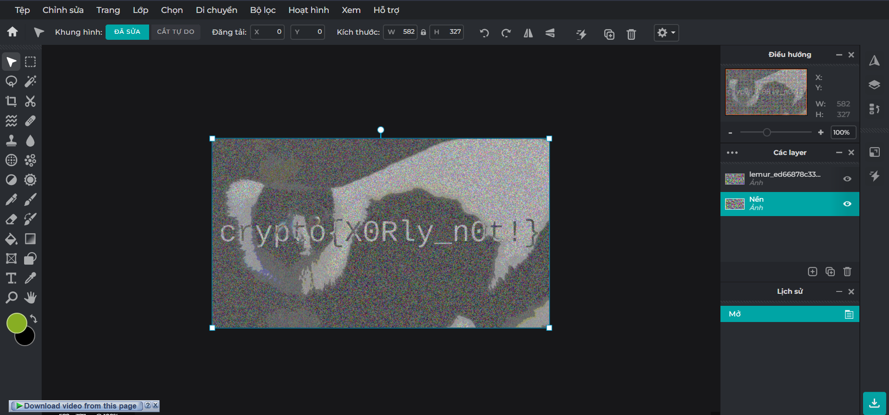
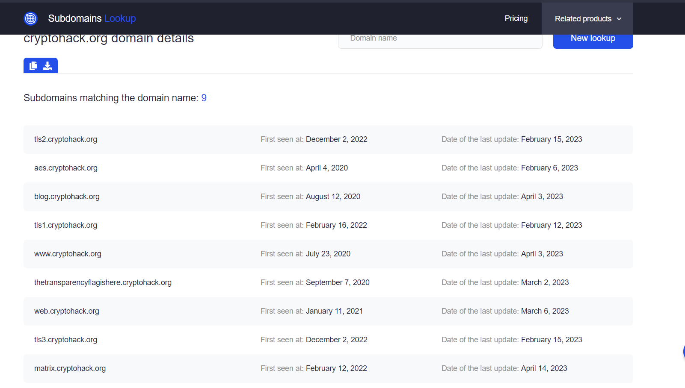

## ASCII


### Solution

The integer array is in the Python syntax so you can copy it and paste in Python code.

After pasted the array, with each element in the array, you can use `chr()` to print the ASCII character in that index.

### Code

```python
array = [99, 114, 121, 112, 116, 111, 123, 65, 83, 67, 73, 73, 95, 112, 114, 49, 110, 116, 52, 98, 108, 51, 125]

for element in array:
    print(chr(element), end = "")

print()
```
## Hex 
### Solution
Copy the hex string to Python code and use `bytes.fromhex()` to change it to bytes string and tou can read it.


### Code

```python
code = "63727970746f7b596f755f77696c6c5f62655f776f726b696e675f776974685f6865785f737472696e67735f615f6c6f747d"
print(bytes.fromhex(code))
```

## Base64
### Solution
Decode the hex string to bytes with `bytes.fromhex()` and then encode it to Base64 wit `b64encode()`

### Code
```python
from base64 import b64encode
code = "72bca9b68fc16ac7beeb8f849dca1d8a783e8acf9679bf9269f7bf"
bytesString = bytes.fromhex(code)
b64code = b64encode(bytesString)
print(b64code)
```

## Bytes and Big Integers
### Solution
Use `long_to_bytes()` to change the number to bytes

### Code
```python
from Crypto.Util.number import long_to_bytes

number = 11515195063862318899931685488813747395775516287289682636499965282714637259206269

print(long_to_bytes(number))
```
## Encoding Challenge
### Solution
I use `pwntools_example.py` to solve this. I look in the `13377.py` and decode all of that

### Code
```python
from pwn import * # pip install pwntools
import json
from Crypto.Util.number import bytes_to_long, long_to_bytes
import codecs
import base64

r = remote('socket.cryptohack.org', 13377, level = 'debug')

def json_recv():
    line = r.recvline()
    return json.loads(line.decode())

def json_send(hsh):
    request = json.dumps(hsh).encode()
    r.sendline(request)


decoded = ""

for stage in range(101):
    received = json_recv()
    decoded = ""
    if (received["type"] == "base64"):
        decoded = base64.b64decode(received["encoded"]).decode()
    elif (received["type"] == "hex"):
        decoded = bytes.fromhex(received["encoded"]).decode()
    elif (received["type"] == "rot13"):
        decoded = codecs.encode(received["encoded"], "rot_13")
    elif (received["type"] == "bigint"):
        decoded = long_to_bytes(int(received["encoded"], 0)).decode()
    elif (received["type"] == "utf-8"):
        for c in received["encoded"]:
            decoded += chr(c)

    to_send ={"decoded": decoded}
    json_send(to_send)

data = json_recv()
```
## XOR Starter
### Solution
Hint says that we can use `pwntools`. And yes, I used `pwntools`

### Code
```python
from pwn import xor
s = b"label"
print(xor(s, 13).decode())
```
## XOR Properties
### Solution
Notice that we have `FLAG ^ KEY1 ^ KEY3 ^ KEY2`, `KEY1` and `KEY2 ^ KEY3`. We can easy xor three of them together and get the flag

### Code
```python
from pwn import xor

k1 = bytes.fromhex("a6c8b6733c9b22de7bc0253266a3867df55acde8635e19c73313")
k23 = bytes.fromhex("c1545756687e7573db23aa1c3452a098b71a7fbf0fddddde5fc1")
flk = bytes.fromhex("04ee9855208a2cd59091d04767ae47963170d1660df7f56f5faf")

flag = xor(flk, xor(k1, k23))

print(flag.decode())
```

## Favourite byte
### Solution
Loop all the bit in 1 byte (0 -> 255) and try to xor and see if `crypto` is in the result, print it.

### Code
```python
from pwn import xor

cipher = "73626960647f6b206821204f21254f7d694f7624662065622127234f726927756d"
code = bytes.fromhex(cipher)

for c in range(256):
    tmp = xor(code, c).decode("utf-8")
    if("crypto" in tmp):
        print(tmp)
        break
```

## You either know, XOR you don't
### Solution
I will xor the cipher text with `crypto{` first because I know that there are  7 first characters will be in the result. Then obviously add the y and xor again with the key I got before.

### Code
```python
from pwn import xor

cipher = bytes.fromhex("0e0b213f26041e480b26217f27342e175d0e070a3c5b103e2526217f27342e175d0e077e263451150104")
key = xor(cipher, "crypto{".encode())
print("I think this is the key: " + key.decode())
print("Obviously, please add the y")
key = key.decode()[:7] + "y"
print(xor(cipher, key.encode()))
```

## Lemur XOR
### Solution
I used photo editor to solve this challenge


## Greatest Common Divisor
### Solution
You can use [Euclidian Algorithm](https://mathworld.wolfram.com/EuclideanAlgorithm.html) or simply `import math` to solve.

### Code

```python
import math

a = 66528
b = 52920
print(math.gcd(a, b))
```

## Extended GCD
### Solution
Just implement [Extended Euclidean](https://www.geeksforgeeks.org/python-program-for-basic-and-extended-euclidean-algorithms-2/) or use [this](https://pypi.org/project/egcd/)

### Code
```python
from egcd import egcd #pip install egcd

p = 26513
q = 32321

print(egcd(p, q))
```

## Modular Arithmethic 1
### Solution
$x \equiv y \;(\mod z) \Leftrightarrow y = (x\mod z)$
Using this transformation, you can easily solve the challenge.

### Code
```python
print(min((11 % 6), (8146798528947 % 17)))
```

## Modular Arithmethic 2
### Solution
This challenge requires you have to know about [Fermat's little theorem](https://en.wikipedia.org/wiki/Fermat%27s_little_theorem).
In this challenge, `65536` is `65537 - 1` which `65537` is a prime. So you can check if `273246787654` and `65536` is coprime or not. If it is, print 1

### Code

```python
import math
a = 273246787654
p = 65537

if(math.gcd(a, p) == 1):
    print(1)
```

## Modular Inverting
### Solution
We can use `inverse` function in `Pycryptodome` to solve.

### Code

```python
from Crypto.Util.number import inverse

print(inverse(3, 13))
```

## Privacy-Enhanced Mail?
### Solution
With the given hint, I just use `RSA.imporKey()` and use `.d()` to print privaet key

### Code

```python
from Crypto.PublicKey import RSA

f = open("privacy_enhanced_mail.pem", "r")
key = f.read()
enc = RSA.importKey(key)
print(enc.d)
```

## CERTainly not
### Solution
First, You have to convert that certificate to `.pem` extension with this command

> openssl x509 -inform der -in 2048b-rsa-example-cert.der -out CERTIFICATE.pem

And then, use the code above and change it to `n`.

### Code

```python
from Crypto.PublicKey import RSA

f = open("CERTIFICATE.pem", "r")
key = f.read()
enc = RSA.importKey(key)
print(enc.n)
```

## SSH Keys
### Solution
First, You have to convert that certificate to `.pem` extension with this command

> ssh-keygen -f bruce_rsa.pub -e -m pem > RSA.pem

And then, use the code above and change it to `n`.

### Code

```python
from Crypto.PublicKey import RSA

f = open("RSA.pem", "r")
key = f.read()
enc = RSA.importKey(key)
print(enc.n)
```

## Transparency
### Solution
The challenge want us to find the subdomain, so we can use [this website](https://subdomains.whoisxmlapi.com/) to find all subdomains of cryptohack


See anything sus?