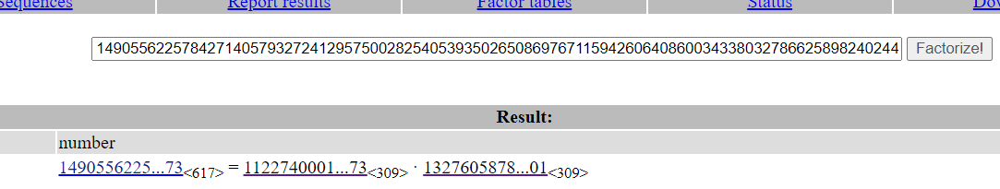

## Quadratic Residues
### Solution
You can use brute force to solve this.

### Code

```python
p = 29
ints = [14, 6, 11]

ans = [x for x in range(p) if(pow(x, 2, p) in ints)]
print(min(ans))
```

## Lengendre Symbol
### Solution
First, we have to find the quadratic residue
`(a/p) = a^((p + 1)/2) mod p`
If `(a/p) = 1` then `a` is quadratic residue
Because `p = 3 mod 4`  so to calculate square root of `a`, we can use [Tonelli–Shanks_algorithm](https://en.wikipedia.org/wiki/Tonelli%E2%80%93Shanks_algorithm)
`a = x^((p + 1) / 4) mod p`

### Code

```python
p = #please give p manually because it's too long

ints = #please give ints manually because it's too long

quad = [x for x in ints if(pow(x, (p - 1)//2, p) == 1)]
# there is one quadratic residue
res = quad[0]
print(pow(res, (p + 1)//4, p))
```

## Modular Square Root
### Solution
Use [Tonelli–Shanks_algorithm](https://en.wikipedia.org/wiki/Tonelli%E2%80%93Shanks_algorithm) to solve

### Code

```python
def legendre(a, p):
    return pow(a, (p - 1) // 2, p)

def tonelli(n, p):
    assert legendre(n, p) == 1, "not a square (mod p)"
    q = p - 1
    s = 0
    while q % 2 == 0:
        q //= 2
        s += 1
    if s == 1:
        return pow(n, (p + 1) // 4, p)
    for z in range(2, p):
        if p - 1 == legendre(z, p):
            break
    c = pow(z, q, p)
    r = pow(n, (q + 1) // 2, p)
    t = pow(n, q, p)
    m = s
    t2 = 0
    while (t - 1) % p != 0:
        t2 = (t * t) % p
        for i in range(1, m):
            if (t2 - 1) % p == 0:
                break
            t2 = (t2 * t2) % p
        b = pow(c, 1 << (m - i - 1), p)
        r = (r * b) % p
        c = (b * b) % p
        t = (t * c) % p
        m = i
    return r

a = #please give a manually
p = #please give p manually

root = tonelli(a, p)
print(min(root, p - root))
```

## Chinese Remainder Theorem
### Solution
We can calculate with [this algorithm](https://www.geeksforgeeks.org/introduction-to-chinese-remainder-theorem/)

### Code

```python
from Crypto.Util.number import inverse

def crt(a, m):
    Mul = 1
    for i in m:
        Mul *= i
    M = [Mul // x for x in m]
    y = [inverse(M[i], m[i]) for i in range(len(m))]
    ans = 0
    for i in range(len(m)):
        ans += a[i] * M[i] * y[i]
    return ans % Mul

a = [2, 3, 5]
m = [5, 11, 17]
print(crt(a, m))
```

## Vectors
### Solution
You can use `numpy.array()` to solve this

### Code

```python
import numpy as np
v = np.array([2, 6, 3])
w = np.array([1, 0, 0])
u = np.array([7, 7, 2])

x = 3*(2*v - w)
y = 2*u

print(x.dot(y))
```

## Size and Basis
### Solution
Yes, `numpy.array()` too.

### Code

```python
import numpy as np
v = np.array([4, 6, 2, 5])

print(pow(v.dot(v), 0.5))
```

## Gram Schmidt
### Solution
Just use `numpy.array()` and Gram-Schimidt algorithm presented in the challenge

### Code

```python
import numpy as np
v = [np.array([4,1,3,-1]),
     np.array([2,1,-3,4]),
     np.array([1,0,-2,7]),
     np.array([6,2,9,-5])]

u = [v[0]]
for i in range(1, 4):
    mi = [np.dot(v[i], u[j]) / np.dot(u[j], u[j]) for j in range(len(u))]
    u += [v[i] - sum([mij * uj for (mij, uj) in zip(mi, u)])]

print(round(u[3][1], 5))
```

## What's a Lattice
### Solution
Use `numpy.linalg.det()` to solve

### Code

```python
import numpy as np
v = np.array([[6, 2, -3], [5, 1, 4], [2, 7, 1]])

print(round(abs(np.linalg.det(v))))
```

## Gaussian Reduction
### Solution
Read the algorithm and try to implement that

### Code

```python
import numpy as np
v1 = np.array([846835985, 9834798552])
v2 = np.array([87502093, 123094980])
m = -1
while(m != 0):
    if (np.dot(v2, v2) < np.dot(v1, v1)):
        t = v1
        v1 = v2
        v2 = t
    m = int((v1.dot(v2)) / (v1.dot(v1)))
    if(m == 0):
        print(v1.dot(v2))
    v2 = v2 - m*v1
```

## Find the Lattice
### Solution
crypto{Gauss_lattice_attack!}

## Backpack Cryptography
### Solution 
crypto{my_kn4ps4ck_1s_l1ghtw31ght}

## Successive Powers
### Solution
`s = [588, 665, 216, 113, 642, 4, 836, 114, 851, 492, 819, 237]`

We know that
$$\begin{align*}{s_0} \cdot x &\equiv {s_1}\left( {\bmod p} \right)\\{s_1} \cdot x &\equiv {s_2}\left( {\bmod p} \right)\\{s_2} \cdot x &\equiv {s_3}\left( {\bmod p} \right)\\&\;\;\vdots \\{s_{10}} \cdot x &\equiv {s_{11}}\left( {\bmod p} \right)\end{align*}$$

$\Leftrightarrow$

$$\begin{align*}x &\equiv {s_1} \cdot {s_0}^{ - 1}\left( {\bmod p} \right)\\x &\equiv {s_2} \cdot {s_1}^{ - 1}\left( {\bmod p} \right)\\x &\equiv {s_3} \cdot {s_2}^{ - 1}\left( {\bmod p} \right)\\&\;\;\vdots \\x &\equiv {s_{11}} \cdot {s_{10}}^{ - 1}\left( {\bmod p} \right)\end{align*}$$
Given `p` is three-digit number, you can brute force `p` to sovle `x`

### Code

```python
from Crypto.Util.number import inverse

s = [588, 665, 216, 113, 642, 4, 836, 114, 851, 492, 819, 237]

pmn = max(s) + 1

for p in range(pmn, 1000):
    x = [(s[i] * inverse(s[i - 1], p)) % p for i in range(1, 12)]
    if(len(set(x)) == 1):
        print(x, p)
        break
```

## Adrien's Signs
### Solution
Notice that we can use Lengendre Symbol to solve because if it is quadrantic residue, the bit is 1 and otherwise.

### Code

```python
arr = #Please input arr manually

a = 288260533169915
p = 1007621497415251

cipher = ""
for i in arr:
    if(pow(i, (p - 1)//2, p) == 1):
        cipher += "1"
    else:
        cipher += "0"


for i in range(0, 224, 8):
    binary = cipher[i:i + 8]
    print(chr(int(binary,2)),end="")
```
crypto{p4tterns_1n_re5idu3s}

## Modular Binomials
### Solution
Factordb for the `N` and you will get `p` and `q`



## Broken RSA
### Solution
$n$ is prime. $e$ is a power of 2, we can we can take consecutive square roots (where possible) to find the $e$-th root.

### Code

```python
from sympy.ntheory.residue_ntheory import sqrt_mod
n = 27772857409875257529415990911214211975844307184430241451899407838750503024323367895540981606586709985980003435082116995888017731426634845808624796292507989171497629109450825818587383112280639037484593490692935998202437639626747133650990603333094513531505209954273004473567193235535061942991750932725808679249964667090723480397916715320876867803719301313440005075056481203859010490836599717523664197112053206745235908610484907715210436413015546671034478367679465233737115549451849810421017181842615880836253875862101545582922437858358265964489786463923280312860843031914516061327752183283528015684588796400861331354873

ct = 11303174761894431146735697569489134747234975144162172162401674567273034831391936916397234068346115459134602443963604063679379285919302225719050193590179240191429612072131629779948379821039610415099784351073443218911356328815458050694493726951231241096695626477586428880220528001269746547018741237131741255022371957489462380305100634600499204435763201371188769446054925748151987175656677342779043435047048130599123081581036362712208692748034620245590448762406543804069935873123161582756799517226666835316588896306926659321054276507714414876684738121421124177324568084533020088172040422767194971217814466953837590498718

for a in sqrt_mod(ct, n, all_roots=True):
    for b in sqrt_mod(a, n, all_roots=True):
        for c in sqrt_mod(b, n, all_roots=True):
            for d in sqrt_mod(c, n, all_roots=True):
                try:
                    print(bytes.fromhex(hex(d)[2:]).decode())
                except:
                    continue
```
crypto{m0dul4r_squ4r3_r00t}

## No Way Back Home
### Solution

## Ellipse Curve Cryptography
### Solution

## Roll your Own
### Solution

## Unencryptable
### Solution
```py 
from Crypto.Util.number import inverse, long_to_bytes

N = 0x7fe8cafec59886e9318830f33747cafd200588406e7c42741859e15994ab62410438991ab5d9fc94f386219e3c27d6ffc73754f791e7b2c565611f8fe5054dd132b8c4f3eadcf1180cd8f2a3cc756b06996f2d5b67c390adcba9d444697b13d12b2badfc3c7d5459df16a047ca25f4d18570cd6fa727aed46394576cfdb56b41
e = 0x10001
ct = 0x5233da71cc1dc1c5f21039f51eb51c80657e1af217d563aa25a8104a4e84a42379040ecdfdd5afa191156ccb40b6f188f4ad96c58922428c4c0bc17fd5384456853e139afde40c3f95988879629297f48d0efa6b335716a4c24bfee36f714d34a4e810a9689e93a0af8502528844ae578100b0188a2790518c695c095c9d677b

p, q = 8239835397208516111720362847949425401045672365829937602117480449316694558226622200110057535873802132963548914201468383545676262090246827792522994758916609, 10900824353334471830007307529937357926160386461967884446160315218630687793341471079170750548554707926611542019859296605188535413447791710067186432371970369
phi = (p - 1) * (q - 1)
d = inverse(e, phi)

pt = pow(ct, d, N)
print(long_to_bytes(pt))
```

## Cofactor Cofantasy
### Solution
crypto{0ver3ng1neering_ch4lleng3_s0lution$}

## Real Eisenstein
### Solution
crypto{r34l_t0_23D_m4p}

## Prime and Prejudice
### Solution
