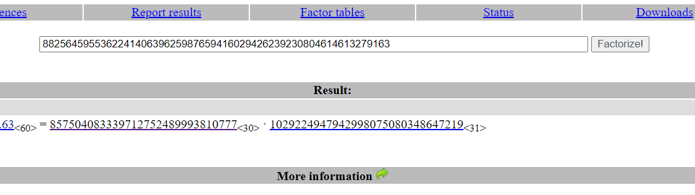
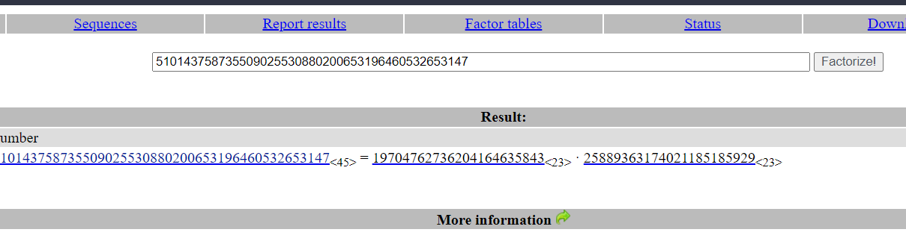
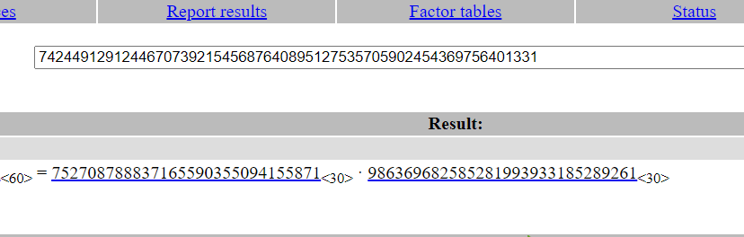

## RSA Starter 1
### Solution
Python have `pow()` function

### Code

```python
print(pow(101,17,22663))
```

## RSA Starter 2
### Solution
Print $12^{p \times q} \mod e$

### Code

```python
e = 65537
p = 17
q = 23
n = 17*23
print(pow(12, e, n))
```

## RSA Starter 3
### Solution
Because $N = p \times q$ and $p$, $q$ are primes so
$$\phi\left({n}\right) = \left({p - 1}\right) \times \left({q - 1}\right)$$

### Code

```python
print(857504083339712752489993810776 * 1029224947942998075080348647218)
```

## RSA Starter 4
### Solution
$$d = e^{-1} \mod \phi\left({n}\right)$$

### Code

```python
from Crypto.Util.number import inverse
e = 65537
p = 857504083339712752489993810777
q = 1029224947942998075080348647219
phi = (p - 1) * (q - 1)
d = inverse(e, phi)
print(d)
```

## RSA Starter 5
### Solution
First, I used [factordb](http://factordb.com/) to find the factors of $n$

We have $p$ and $q$ now.
Calculate in sequence:
$$\begin{align*}\phi  &= \left( {p - 1} \right) \times \left( {q - 1} \right)\\d &= {e^{ - 1}}\bmod \phi \\m &= {c^d}\bmod n\end{align*}$$

### Code

```python
from Crypto.Util.number import inverse
e = 65537
p = 857504083339712752489993810777
q = 1029224947942998075080348647219
n = p * q
phi = (p - 1) * (q - 1)
d = inverse(e, phi)
c = 77578995801157823671636298847186723593814843845525223303932
print(pow(c, d, n))
```

## RSA Starter 6
### Solution
SHA256 first, and then encrypt
$$c = m^{d} \mod n$$

### Code

```python
from Crypto.Util.number import inverse, bytes_to_long
from hashlib import sha256
N = 15216583654836731327639981224133918855895948374072384050848479908982286890731769486609085918857664046075375253168955058743185664390273058074450390236774324903305663479046566232967297765731625328029814055635316002591227570271271445226094919864475407884459980489638001092788574811554149774028950310695112688723853763743238753349782508121985338746755237819373178699343135091783992299561827389745132880022259873387524273298850340648779897909381979714026837172003953221052431217940632552930880000919436507245150726543040714721553361063311954285289857582079880295199632757829525723874753306371990452491305564061051059885803
d = 11175901210643014262548222473449533091378848269490518850474399681690547281665059317155831692300453197335735728459259392366823302405685389586883670043744683993709123180805154631088513521456979317628012721881537154107239389466063136007337120599915456659758559300673444689263854921332185562706707573660658164991098457874495054854491474065039621922972671588299315846306069845169959451250821044417886630346229021305410340100401530146135418806544340908355106582089082980533651095594192031411679866134256418292249592135441145384466261279428795408721990564658703903787956958168449841491667690491585550160457893350536334242689

s = "crypto{Immut4ble_m3ssag1ng}"
sh = sha256(s.encode()).digest()
m = pow(bytes_to_long(sh), d, N)
print(m)
```

## Factoring
### Solution
Yes, factordb


## Inferius Prime
### Solution
Use factordb again and you will get $p$ and $q$


After that, decrypt like RSA Starter 5

### Code

```python
from Crypto.Util.number import inverse, bytes_to_long, long_to_bytes

n = 742449129124467073921545687640895127535705902454369756401331
e = 3
ct = 39207274348578481322317340648475596807303160111338236677373

p = 752708788837165590355094155871
q = 986369682585281993933185289261

phi = (p -1) * (q - 1)
d = inverse(e, phi)
m = pow(ct, d, n)
print(long_to_bytes(m))
```

## Monoprime
### Solution
If $n$ is prime, $\phi\left({n}\right) = n - 1$

### Code

```python
from Crypto.Util.number import inverse, bytes_to_long, long_to_bytes
n = 171731371218065444125482536302245915415603318380280392385291836472299752747934607246477508507827284075763910264995326010251268493630501989810855418416643352631102434317900028697993224868629935657273062472544675693365930943308086634291936846505861203914449338007760990051788980485462592823446469606824421932591                                                                  
e = 65537
ct = 161367550346730604451454756189028938964941280347662098798775466019463375610700074840105776873791605070092554650190486030367121011578171525759600774739890458414593857709994072516290998135846956596662071379067305011746842247628316996977338024343628757374524136260758515864509435302781735938531030576289086798942  
phi = n - 1
d = inverse(e, phi)
m = pow(ct, d, n)
print(long_to_bytes(m))
```

## Square Eyes
### Solution
You can use factordb to factorize first and we have this formula:
$$\phi \left( n \right) = n\left( {1 - \frac{1}{p}} \right) = n - p = p\left( {p - 1} \right)$$

### Code

```python
from Crypto.Util.number import inverse, bytes_to_long, long_to_bytes
import math

n = 535860808044009550029177135708168016201451343147313565371014459027743491739422885443084705720731409713775527993719682583669164873806842043288439828071789970694759080842162253955259590552283047728782812946845160334801782088068154453021936721710269050985805054692096738777321796153384024897615594493453068138341203673749514094546000253631902991617197847584519694152122765406982133526594928685232381934742152195861380221224370858128736975959176861651044370378539093990198336298572944512738570839396588590096813217791191895941380464803377602779240663133834952329316862399581950590588006371221334128215409197603236942597674756728212232134056562716399155080108881105952768189193728827484667349378091100068224404684701674782399200373192433062767622841264055426035349769018117299620554803902490432339600566432246795818167460916180647394169157647245603555692735630862148715428791242764799469896924753470539857080767170052783918273180304835318388177089674231640910337743789750979216202573226794240332797892868276309400253925932223895530714169648116569013581643192341931800785254715083294526325980247219218364118877864892068185905587410977152737936310734712276956663192182487672474651103240004173381041237906849437490609652395748868434296753449
e = 65537
ct = 222502885974182429500948389840563415291534726891354573907329512556439632810921927905220486727807436668035929302442754225952786602492250448020341217733646472982286222338860566076161977786095675944552232391481278782019346283900959677167026636830252067048759720251671811058647569724495547940966885025629807079171218371644528053562232396674283745310132242492367274184667845174514466834132589971388067076980563188513333661165819462428837210575342101036356974189393390097403614434491507672459254969638032776897417674577487775755539964915035731988499983726435005007850876000232292458554577437739427313453671492956668188219600633325930981748162455965093222648173134777571527681591366164711307355510889316052064146089646772869610726671696699221157985834325663661400034831442431209123478778078255846830522226390964119818784903330200488705212765569163495571851459355520398928214206285080883954881888668509262455490889283862560453598662919522224935145694435885396500780651530829377030371611921181207362217397805303962112100190783763061909945889717878397740711340114311597934724670601992737526668932871436226135393872881664511222789565256059138002651403875484920711316522536260604255269532161594824301047729082877262812899724246757871448545439896
p = 23148667521998097720857168827790771337662483716348435477360567409355026169165934446949809664595523770853897203103759106983985113264049057416908191166720008503275951625738975666019029172377653170602440373579593292576530667773951407647222757756437867216095193174201323278896027294517792607881861855264600525772460745259440301156930943255240915685718552334192230264780355799179037816026330705422484000086542362084006958158550346395941862383925942033730030004606360308379776255436206440529441711859246811586652746028418496020145441513037535475380962562108920699929022900677901988508936509354385660735694568216631382653107
phi = (p - 1) * (p)
d = inverse(e, phi)
m = pow(ct, d, n)
print(long_to_bytes(m))
```

## Manyprime
### Solution
Factordb again, it's too strong
![[Manyprime.png]]

### Code

```python
from Crypto.Util.number import inverse, bytes_to_long, long_to_bytes
import requests


n = 580642391898843192929563856870897799650883152718761762932292482252152591279871421569162037190419036435041797739880389529593674485555792234900969402019055601781662044515999210032698275981631376651117318677368742867687180140048715627160641771118040372573575479330830092989800730105573700557717146251860588802509310534792310748898504394966263819959963273509119791037525504422606634640173277598774814099540555569257179715908642917355365791447508751401889724095964924513196281345665480688029639999472649549163147599540142367575413885729653166517595719991872223011969856259344396899748662101941230745601719730556631637
e = 65537
ct = 320721490534624434149993723527322977960556510750628354856260732098109692581338409999983376131354918370047625150454728718467998870322344980985635149656977787964380651868131740312053755501594999166365821315043312308622388016666802478485476059625888033017198083472976011719998333985531756978678758897472845358167730221506573817798467100023754709109274265835201757369829744113233607359526441007577850111228850004361838028842815813724076511058179239339760639518034583306154826603816927757236549096339501503316601078891287408682099750164720032975016814187899399273719181407940397071512493967454225665490162619270814464

arr = [9282105380008121879, 9303850685953812323, 9389357739583927789, 10336650220878499841, 10638241655447339831, 11282698189561966721, 11328768673634243077, 11403460639036243901, 11473665579512371723, 11492065299277279799, 11530534813954192171, 11665347949879312361, 12132158321859677597, 12834461276877415051, 12955403765595949597, 12973972336777979701, 13099895578757581201, 13572286589428162097, 14100640260554622013, 14178869592193599187, 14278240802299816541, 14523070016044624039, 14963354250199553339, 15364597561881860737, 15669758663523555763, 15824122791679574573, 15998365463074268941, 16656402470578844539, 16898740504023346457, 17138336856793050757, 17174065872156629921, 17281246625998849649] 

phi = 1
for i in arr:
    phi *= (i - 1)
d = inverse(e, phi)
m = pow(ct, d, n)
print(long_to_bytes(m))
```

## Salty
### Solution
$$\begin{align*}e &= 1\\\Leftrightarrow d &= 1^{-1} = 1 \\\end{align*}$$

### Code

```python
from Crypto.Util.number import inverse, bytes_to_long, long_to_bytes
n = 110581795715958566206600392161360212579669637391437097703685154237017351570464767725324182051199901920318211290404777259728923614917211291562555864753005179326101890427669819834642007924406862482343614488768256951616086287044725034412802176312273081322195866046098595306261781788276570920467840172004530873767                                                                  

e = 1
ct = 44981230718212183604274785925793145442655465025264554046028251311164494127485


d = 1
m = pow(ct, d, n)
print(long_to_bytes(m))
```

## Modulus Inutilis
### Solution
`ct = pow(pt, e, n)`

I see that n >> ct, so just calculate $pt = \sqrt[e]{{ct}}$

### Code

```python
from Crypto.Util.number import inverse, bytes_to_long, long_to_bytes 
from sympy import cbrt
n = 17258212916191948536348548470938004244269544560039009244721959293554822498047075403658429865201816363311805874117705688359853941515579440852166618074161313773416434156467811969628473425365608002907061241714688204565170146117869742910273064909154666642642308154422770994836108669814632309362483307560217924183202838588431342622551598499747369771295105890359290073146330677383341121242366368309126850094371525078749496850520075015636716490087482193603562501577348571256210991732071282478547626856068209192987351212490642903450263288650415552403935705444809043563866466823492258216747445926536608548665086042098252335883
e = 3
ct = 243251053617903760309941844835411292373350655973075480264001352919865180151222189820473358411037759381328642957324889519192337152355302808400638052620580409813222660643570085177957

m = cbrt(ct)
print(long_to_bytes(m))
```

## Everything is Big
### Solution
Because n, e is too big. So we have to use [Wiener's attack](https://en.wikipedia.org/wiki/Wiener's_attack) to solve.

### Code

This code is in sage. After got the $m$, use `long_to_bytes` to convert it.

```python
from Crypto.Util.number import long_to_bytes
def wiener(e, n):
    # Convert e/n into a continued fraction
    cf = continued_fraction(e/n)
    convergents = cf.convergents()
    for kd in convergents:
        k = kd.numerator()
        d = kd.denominator()
        # Check if k and d meet the requirements
        if k == 0 or d%2 == 0 or e*d % k != 1:
            continue
        phi = (e*d - 1)/k
        # Create the polynomial
        x = PolynomialRing(RationalField(), 'x').gen()
        f = x^2 - (n-phi+1)*x + n
        roots = f.roots()
        # Check if polynomial as two roots
        if len(roots) != 2:
            continue
        # Check if roots of the polynomial are p and q
        p,q = int(roots[0][0]), int(roots[1][0])
        if p*q == n:
            return d
    return None
n = 0xb8af3d3afb893a602de4afe2a29d7615075d1e570f8bad8ebbe9b5b9076594cf06b6e7b30905b6420e950043380ea746f0a14dae34469aa723e946e484a58bcd92d1039105871ffd63ffe64534b7d7f8d84b4a569723f7a833e6daf5e182d658655f739a4
e37bd9f4a44aff6ca0255cda5313c3048f56eed5b21dc8d88bf5a8f8379eac83d8523e484fa6ae8dbcb239e65d3777829a6903d779cd2498b255fcf275e5f49471f35992435ee7cade98c8e82a8beb5ce1749349caa16759afc4e799edb12d299374d748a9e3c82
e1cc983cdf9daec0a2739dadcc0982c1e7e492139cbff18c5d44529407edfd8e75743d2f51ce2b58573fea6fbd4fe25154b9964d
e = 0x9ab58dbc8049b574c361573955f08ea69f97ecf37400f9626d8f5ac55ca087165ce5e1f459ef6fa5f158cc8e75cb400a7473e89dd38922ead221b33bc33d6d716fb0e4e127b0fc18a197daf856a7062b49fba7a86e3a138956af04f481b7a7d481994aeeb
c2672e500f3f6d8c581268c2cfad4845158f79c2ef28f242f4fa8f6e573b8723a752d96169c9d885ada59cdeb6dbe932de86a019a7e8fc8aeb07748cfb272bd36d94fe83351252187c2e0bc58bb7a0a0af154b63397e6c68af4314601e29b07caed301b6831cf34
caa579eb42a8c8bf69898d04b495174b5d7de0f20cf2b8fc55ed35c6ad157d3e7009f16d6b61786ee40583850e67af13e9d25be3
c = 0x3f984ff5244f1836ed69361f29905ca1ae6b3dcf249133c398d7762f5e277919174694293989144c9d25e940d2f66058b2289c75d1b8d0729f9a7c4564404a5fd4313675f85f31b47156068878e236c5635156b0fa21e24346c2041ae42423078577a1413
f41375a4d49296ab17910ae214b45155c4570f95ca874ccae9fa80433a1ab453cbb28d780c2f1f4dc7071c93aff3924d76c5b4068a0371dff82531313f281a8acadaa2bd5078d3ddcefcb981f37ff9b8b14c7d9bf1accffe7857160982a2c7d9ee01d3e82265eec
9c7401ecc7f02581fd0d912684f42d1b71df87a1ca51515aab4e58fab4da96e154ea6cdfb573a71d81b2ea4a080a1066e1bc3474
d = wiener(e, n)
m = pow(c, d, n)
```

## Crossed Wires
### Solution
$$c = {\left( {{{\left( {{{\left( {{{\left({{m^{{k_1}}}}\right)}^{{k_2}}}}\right)}^{{k_3}}}} \right)}^{{k_4}}}} \right)^{{k_5}}}\bmod n = {m^{{k_1}\times {k_2} \times {k_3} \times {k_4} \times {k_5}}}\bmod n$$

So you just get the modular inverse of ${k_1}\times {k_2} \times {k_3} \times {k_4} \times {k_5}$ and solve.

### Code

```python
from Crypto.Util.number import inverse, long_to_bytes
c = 20304610279578186738172766224224793119885071262464464448863461184092225736054747976985179673905441502689126216282897704508745403799054734121583968853999791604281615154100736259131453424385364324630229671185343778172807262640709301838274824603101692485662726226902121105591137437331463201881264245562214012160875177167442010952439360623396658974413900469093836794752270399520074596329058725874834082188697377597949405779039139194196065364426213208345461407030771089787529200057105746584493554722790592530472869581310117300343461207750821737840042745530876391793484035024644475535353227851321505537398888106855012746117

n = 21711308225346315542706844618441565741046498277716979943478360598053144971379956916575370343448988601905854572029635846626259487297950305231661109855854947494209135205589258643517961521594924368498672064293208230802441077390193682958095111922082677813175804775628884377724377647428385841831277059274172982280545237765559969228707506857561215268491024097063920337721783673060530181637161577401589126558556182546896783307370517275046522704047385786111489447064794210010802761708615907245523492585896286374996088089317826162798278528296206977900274431829829206103227171839270887476436899494428371323874689055690729986771

e = 65537
d = 2734411677251148030723138005716109733838866545375527602018255159319631026653190783670493107936401603981429171880504360560494771017246468702902647370954220312452541342858747590576273775107870450853533717116684326976263006435733382045807971890762018747729574021057430331778033982359184838159747331236538501849965329264774927607570410347019418407451937875684373454982306923178403161216817237890962651214718831954215200637651103907209347900857824722653217179548148145687181377220544864521808230122730967452981435355334932104265488075777638608041325256776275200067541533022527964743478554948792578057708522350812154888097

fk = [106979, 108533, 69557, 97117, 103231]
ed1 = e*d-1
k = inverse(106979 * 108533 * 69557 * 97117 * 103231, ed1)
m = pow(c, k, n)
print(long_to_bytes(m))
```

## Everything is Still Big
### Solution
Because [Wiener's attack](https://en.wikipedia.org/wiki/Wiener's_attack) can't solve so we have to use [Boneh-Durfee attack](https://cryptohack.gitbook.io/cryptobook/untitled/low-private-component-attacks/boneh-durfee-attack)

### Code

Because the code is too long so I'll give you this [code](https://github.com/mimoo/RSA-and-LLL-attacks/blob/master/boneh_durfee.sage). Change $N$ and $e$ value, and then just run with sage.

## Endless Emails
### Solution
[Hastad's Broadcast Attack](https://en.wikipedia.org/wiki/Coppersmith%27s_attack) will be useful.

### Code

```python
from sympy.ntheory.modular import crt
from itertools import combinations
from gmpy2 import iroot

N = [] #please input C manually in list
C = [] #please input C manually in list

for i in list(combinations([i for i in range(7)],3)):
        n1, n2, n3 = N[i[0]], N[i[1]], N[i[2]]
        c1, c2, c3 = C[i[0]], C[i[1]], C[i[2]]
        m = bytes.fromhex(hex(iroot(crt((n1,n2,n3),(c1,c2,c3))[0],3)[0])[2:])
        if b'crypto' in m:
                print(m.decode())
                break

```
## Infinite Descent
### Solution
FactorDB is chad.

### Code

```python
from Crypto.Util.number import inverse, long_to_bytes
from factordb.factordb import FactorDB
n = 383347712330877040452238619329524841763392526146840572232926924642094891453979246383798913394114305368360426867021623649667024217266529000859703542590316063318592391925062014229671423777796679798747131250552455356061834719512365575593221216339005132464338847195248627639623487124025890693416305788160905762011825079336880567461033322240015771102929696350161937950387427696385850443727777996483584464610046380722736790790188061964311222153985614287276995741553706506834906746892708903948496564047090014307484054609862129530262108669567834726352078060081889712109412073731026030466300060341737504223822014714056413752165841749368159510588178604096191956750941078391415634472219765129561622344109769892244712668402761549412177892054051266761597330660545704317210567759828757156904778495608968785747998059857467440128156068391746919684258227682866083662345263659558066864109212457286114506228470930775092735385388316268663664139056183180238043386636254075940621543717531670995823417070666005930452836389812129462051771646048498397195157405386923446893886593048680984896989809135802276892911038588008701926729269812453226891776546037663583893625479252643042517196958990266376741676514631089466493864064316127648074609662749196545969926051
e = 65537
c = 98280456757136766244944891987028935843441533415613592591358482906016439563076150526116369842213103333480506705993633901994107281890187248495507270868621384652207697607019899166492132408348789252555196428608661320671877412710489782358282011364127799563335562917707783563681920786994453004763755404510541574502176243896756839917991848428091594919111448023948527766368304503100650379914153058191140072528095898576018893829830104362124927140555107994114143042266758709328068902664037870075742542194318059191313468675939426810988239079424823495317464035252325521917592045198152643533223015952702649249494753395100973534541766285551891859649320371178562200252228779395393974169736998523394598517174182142007480526603025578004665936854657294541338697513521007818552254811797566860763442604365744596444735991732790926343720102293453429936734206246109968817158815749927063561835274636195149702317415680401987150336994583752062565237605953153790371155918439941193401473271753038180560129784192800351649724465553733201451581525173536731674524145027931923204961274369826379325051601238308635192540223484055096203293400419816024111797903442864181965959247745006822690967920957905188441550106930799896292835287867403979631824085790047851383294389

f = FactorDB(n)
f.connect()
arr = f.get_factor_from_api()

p = int(arr[0][0])
q = int(arr[1][0])
phi = (p - 1) * (q - 1)
d = inverse(e, phi)
m = pow(c, d, n)
print(long_to_bytes(m))
```


## Marin's Secret
### Solution
I don't know but FactorDB is too powerful.

### Code

```python
from Crypto.Util.number import inverse, long_to_bytes
from factordb.factordb import FactorDB
n = 658416274830184544125027519921443515789888264156074733099244040126213682497714032798116399288176502462829255784525977722903018714434309698108208388664768262754316426220651576623731617882923164117579624827261244506084274371250277849351631679441171018418018498039996472549893150577189302871520311715179730714312181456245097848491669795997289830612988058523968384808822828370900198489249243399165125219244753790779764466236965135793576516193213175061401667388622228362042717054014679032953441034021506856017081062617572351195418505899388715709795992029559042119783423597324707100694064675909238717573058764118893225111602703838080618565401139902143069901117174204252871948846864436771808616432457102844534843857198735242005309073939051433790946726672234643259349535186268571629077937597838801337973092285608744209951533199868228040004432132597073390363357892379997655878857696334892216345070227646749851381208554044940444182864026513709449823489593439017366358869648168238735087593808344484365136284219725233811605331815007424582890821887260682886632543613109252862114326372077785369292570900594814481097443781269562647303671428895764224084402259605109600363098950091998891375812839523613295667253813978434879172781217285652895469194181218343078754501694746598738215243769747956572555989594598180639098344891175879455994652382137038240166358066403475457 
e = 65537
c = 400280463088930432319280359115194977582517363610532464295210669530407870753439127455401384569705425621445943992963380983084917385428631223046908837804126399345875252917090184158440305503817193246288672986488987883177380307377025079266030262650932575205141853413302558460364242355531272967481409414783634558791175827816540767545944534238189079030192843288596934979693517964655661507346729751987928147021620165009965051933278913952899114253301044747587310830419190623282578931589587504555005361571572561916866063458812965314474160499067525067495140150092119620928363007467390920130717521169105167963364154636472055084012592138570354390246779276003156184676298710746583104700516466091034510765027167956117869051938116457370384737440965109619578227422049806566060571831017610877072484262724789571076529586427405780121096546942812322324807145137017942266863534989082115189065560011841150908380937354301243153206428896320576609904361937035263985348984794208198892615898907005955403529470847124269512316191753950203794578656029324506688293446571598506042198219080325747328636232040936761788558421528960279832802127562115852304946867628316502959562274485483867481731149338209009753229463924855930103271197831370982488703456463385914801246828662212622006947380115549529820197355738525329885232170215757585685484402344437894981555179129287164971002033759724456


f = FactorDB(n)
f.connect()
arr = f.get_factor_from_api()

p = int(arr[0][0])
q = int(arr[1][0])
phi = (p - 1) * (q - 1)
d = inverse(e, phi)
m = pow(c, d, n)
print(long_to_bytes(m))
```


## Fast Primes
### Solution
First, remember what you did at [General](General/General.md)? Use that again to extract $n$.
After that, factorDB is always first choice and just copy the code in `fast_primes.py` to decrypt

### Code

```python
from Crypto.Util.number import inverse, long_to_bytes
from factordb.factordb import FactorDB
from Crypto.PublicKey import RSA
from Crypto.Cipher import PKCS1_OAEP
f = open("key.pem", "r")
mail = f.read()
key = RSA.importKey(mail)
n = key.n
f.close()

c = "249d72cd1d287b1a15a3881f2bff5788bc4bf62c789f2df44d88aae805b54c9a94b8944c0ba798f70062b66160fee312b98879f1dd5d17b33095feb3c5830d28"

fdb = FactorDB(n)
fdb.connect()
arr = fdb.get_factor_from_api()
p = int(arr[0][0])
q = int(arr[1][0])
phi = (p - 1) * (q - 1)
e = 0x10001

d = inverse(e, phi)
key = RSA.construct((n, e, d))
cipher = PKCS1_OAEP.new(key)

m = cipher.decrypt(long_to_bytes(int(c, 16)))
print(m)
```


## Ron was Wrong, Whit is Right
### Solution
Look at `excerpt.py`, you will se it opens file no. 21. So just decrypt it

### Code

```python
from Crypto.PublicKey import RSA

from Crypto.Cipher import PKCS1_OAEP

e = 65537

n = 0xD5D96F9FD950E5FF99B1673588FC3A1D5638F3B297EC049226167854C5061A40FE6154278535CB4BB356C8BEAA1EEF6D6F1E69CF2C82E234FAE428C47916955D3B3019D1FF92271904B8C129487489AC947F3012B38AD87B71BADA7A164C302D1ECDFE5410CCC4689DFBF4EC828C4A428FDE4C6EC4BDC8BD31D0D40201E15C0A907CCE0EB7F1D6971A20C22900B3B483C9A64B364C5914429CAAB4BCD6E753366D25B1471EA0D5C1C5BEBADA2A8524DF10ED2E1762361A0E749C65D59CF07C210E7A92B41275013BD521733DF80077ACD949F86546DE413B033879F7ED642AA75545FF599740A1EB925430B1294CA450B812712F363631B99B73122FE5B6C110FCFA6B789342DAAE138F67AB1D3B7C47313682F5BC205AFFF312E1F0576304C84F75B58AB33C1D0C41EFA314973A78992667C473566CBB80E243FBF6AC08CDCC61D5A50361160CA779869672732E552A85025E9C5AF9A6236AD379759518B1742223B6CA3A78580DBFE303D67758B2A2F692D142D2EEA4BCE55BC8BE2BA16D66D524D7722B39FC1593B67C5EFE8DE64C50A5BF37EF8BA05674AE66EEF27B3E9E9B13C1447A2F354814C6357D01F8AE96DC389A0CECF04EBF5A993691CDB4802EDA575011DB144A4A6256C1802BD7F2E201E8BF084B95D03ED9CFBBEDDD2977332D7BBF84847325FE8A42AC1B2FFC5377AB1279757FE2DF7A76FB46A1787F7CC4760A91DF487E63DC09228FDB906A9BC7C0DCA22F8B7B05DDBE277B58774697F78A60DF05AD1E1CD72B9604BA42E27F20A1D567FE4F510F0F9774B0D2AF0AE169CC71C73DFEA0193DAB8969A052FF99FDE06B5093928C4A7B483DFA25730BDB64FEAD44F764687BE9FCE08CCA41D5351E637F4EB264CFA4D5446B299E7F147CF21C64A4479DE8F2532F9F268F700214FF99017D0364C6A9EA145E06A919F98D8A51B2A601E08308C1F050621E91666095100A8F4A2A0B216922FD1A6C17364AB10AD49F6FE49DAAFD7E2793EB9F7C703E62122DDEAE2BF6446BCAFCD773AFAD426D6E82076092B10CDF34ED48F46106C6EAC36CE3CD3BF2DA768251A155287A32FF7725811E3BCD0527616A757A94207293F08E04088A9C80E1DF60431E1E26AE29BFF6DA974CE80CB155C0E31920D565F12DFB9677DFAA34A6B262CCBFA7DAA673E47325EFC455A3B65F25B5FEDFCD63D61A925876886DAB10EBDD8D5E5F36B9DE24809C6500A50FEEC133E04CA8490E517C3399522EB502D9F6983F6DBDC929BF99FFAEF573EE740676EAA5BDDDA010F127A0F560875AE0985D06A906257AC08D55E9E5344CF5CC28812515EE6A9412EB6EE4A6FA2D76A9A317B960B9DF25F88CB0FF3482DDAE9BF310B78CFB8DBA04C5214780EFCBE53AE038C7F9FF438C6F5E239DA5740E6518B1D2D7AF666D0C7E65CD74F1DC847393234629CF91726E8F

p = 919031168254299342928662994540730760042229248845820491699169870943314884504551963184014786520812939038906152950817942941469675496074887272906954399256046690838233813273902630076899906873722574023918253104149453601408405078374008695616160025877687382663027910687942091698042309812910101246025081363544171351624307177908410700904833438480012985928358897861427063761678614898919524867442676631453135379994570031284289815099294504127712924001149921480778993635917803466637717023744788311275545126346774536416864472035644211758788016642401235014385037912224180351022196262011724157012443048941426178651665266181311662824205620324073087330858064769424755443807165558567191049013947419763315902476674266627953223373671797370373786249718677582213173537848582863398367624397247597103174897140005790273296171101569756006898658668311846034013183862374297777882433967015111727139360441681664840944403450472574336901043555319067050153928231938431298082827397506406624964952344826628463723499263165279281720105570577138817805451223334196017505528543229067732013216932022575286870744622250293712218581458417969597311485156075637589299870500738770767213366940656708757081771498126771190548298648709527029056697749965377697006723247968508680596118923

q = 991430390905926023965735525726256769345153760248048478891327804533279477721590201738061124861790305326884541900044434890157058142414306020739922709698601329762087825767461256626800629782378634339618941488765491437487541851308806651586976069659042714378353883168031522106709494592827914376213512564492771821921367377484213072867988877925314809325159382342584541006645302760204539354879391605736604946702073863673524002591877977949645618863730441482821840664748508050205004505250025193611888170440612737112479006348533153568103452396596042639466753099280111709882461562564978070397786887446291916733276692400981917025361391646188802038772976331121474570242334921390569285834250256522656433623912544555266998750630136756355560927237594975904642791712318215315246754105993145827690531584325461597482035600919501967088106457091199733024323755210212616553447076697617349235377466327471959683763796707566328536834402308887105044128592177681553611608618850780128709949316259039664054913946726480968288231015999572777436469163437066403964134928735809253108394078092917006632332098357725950865697047565284013456253933234017983509582245874130968218422573483012858388392588302838940565560162598810462310034964473576147200222580784694005333482381

c = 0xc62d91677825632cb8ac9d2fbee7490fca70b3f067bd8d811fa446a21001de7943cacafc429b2513d3f20c3224d212ca2937a4a4ea10792a1c498b791e978e4b050b525576bc68421e40d9f420c0b8a07778daf69edf2095bf48222896bb2d6581288ce7a2e7aec15a88a440ff1a1e48beb56f68b4f860d1f64a6ec8cafed90846b7d893bc482df69c8478d5a0d6fc2d043cdd97178740a9eb59d2576b5136200c8ea77e648c88e6c5104ca5d0c6add2fc2c8569ce909f8461e7fa3d901fe67eaeff656399d4751fedba9973e246427e0c7a217f5bdc3edcb5033f17b5ef53419e340355a809eb46f48f538e880abd6f72212b02d3dbf2c4f633a503e648d1a835c4574b23e329e1c51078ea7cbb7533e771899498d4a5760bc0799b7e046f268f098fe0b57de47cd70ccf01ad3c9daec5027f306141bfe7a6c0bd29ee6caf94c7433c25e34ee974005e2360337cb6b3cec5eaf5d31d19f01435f4cdcaa455a18e78dee078395b8ad14b9c3a0d817dc1e3109c7b8af35ab3a5950bf47d5e621f9373ef421540052aac307ecea91f9c29c14bfd81b41d4c5a9b34a8ec2fa1ae06c3d881f39286c3d8dbb1849602fecc27bb135f7dd443e2598d247d1182d350b04be1ac0a734cb0e852a36902d88066ac375a35e279b126e413a97aaa35a0ba933f7b8d574c298332ce428c181464b240709a414af1b77103441b6ccfd0790eccea5926844054903c83f4cb415d600a6b7bc771c9e7a86394a2b427ebe8edec08b8095f561827716898e11caf6f0fe562af8a69f7b6469f0e86bdcc32f429f10821c763b34307efc5b2ae7fd524a07e5d0b762c096f025a3f240fb7bd3554582dcce32c175867d93970b0422e17870ec58f2a305545a3d284b3abb2d21a45ad8fd5faed0dc66312a5aa2f994606a51cd6682acd48ea3fb883f0611e1e5c2fb4047b5c80815ba5d3bcfefaf121bfde4d5c91ee27bb899ef0d29fa5c6dc4223ac2bfcff0217d08579a13e9b02dc97aa2622df62eeaaa38bb3bd087cdd209f03e8926a951e90eaa0f678a252a067ac66402a4c85865931689ed3b33f9f6de0c499f140ef508dfba6007a607a271dcbec18a61f7488bba34d143f93bc259310ffbf23f3391734d8d8811a4be8abf6382e55c2ccbfd80b1559d907fd8d46e0431cdbcd8fdb06d57973437f7b8ff5efc5a53c80d552e8fe622971f7376eeea35f4df9b32ada93e531a52b63ba13f6b7bf61ab337d6d93feb0e8c8a309dfa7e5f50e8cf9655b73ae64822b50db5312f35f4718b0668305065ea283ddf8f0a4e8f486ee9d119ebc584be1837b3d959a25ace208ffac2fb703390a72d3027b64fdd1955b513c0403f09232efa1794a277e0be3f4f9f3a6fd23c6e52101e723cef5db7a2a18a107cd522379adb40c5ed36b26cdf53a1000d7d576f1157b42aac3d3ee011275

d = pow(e, -1, (p-1)*(q-1))

key = RSA.construct((n, e, d))

cipher = PKCS1_OAEP.new(key)

print(cipher.decrypt(bytes.fromhex(hex(c)[2:])).decode())
```


## RSA Backdoor Viability
### Solution
Same as Marin's Secret

### Code

```python
from Crypto.Util.number import inverse, long_to_bytes
from factordb.factordb import FactorDB


n = 709872443186761582125747585668724501268558458558798673014673483766300964836479167241315660053878650421761726639872089885502004902487471946410918420927682586362111137364814638033425428214041019139158018673749256694555341525164012369589067354955298579131735466795918522816127398340465761406719060284098094643289390016311668316687808837563589124091867773655044913003668590954899705366787080923717270827184222673706856184434629431186284270269532605221507485774898673802583974291853116198037970076073697225047098901414637433392658500670740996008799860530032515716031449787089371403485205810795880416920642186451022374989891611943906891139047764042051071647203057520104267427832746020858026150611650447823314079076243582616371718150121483335889885277291312834083234087660399534665835291621232056473843224515909023120834377664505788329527517932160909013410933312572810208043849529655209420055180680775718614088521014772491776654380478948591063486615023605584483338460667397264724871221133652955371027085804223956104532604113969119716485142424996255737376464834315527822566017923598626634438066724763559943441023574575168924010274261376863202598353430010875182947485101076308406061724505065886990350185188453776162319552566614214624361251463
e = 65537
c = 608484617316138126443275660524263025508135383745665175433229598517433030003704261658172582370543758277685547533834085899541036156595489206369279739210904154716464595657421948607569920498815631503197235702333017824993576326860166652845334617579798536442066184953550975487031721085105757667800838172225947001224495126390587950346822978519677673568121595427827980195332464747031577431925937314209391433407684845797171187006586455012364702160988147108989822392986966689057906884691499234298351003666019957528738094330389775054485731448274595330322976886875528525229337512909952391041280006426003300720547721072725168500104651961970292771382390647751450445892361311332074663895375544959193148114635476827855327421812307562742481487812965210406231507524830889375419045542057858679609265389869332331811218601440373121797461318931976890674336807528107115423915152709265237590358348348716543683900084640921475797266390455366908727400038393697480363793285799860812451995497444221674390372255599514578194487523882038234487872223540513004734039135243849551315065297737535112525440094171393039622992561519170849962891645196111307537341194621689797282496281302297026025131743423205544193536699103338587843100187637572006174858230467771942700918388
f = FactorDB(n)
f.connect()
arr = f.get_factor_from_api()

p = int(arr[0][0])
q = int(arr[1][0])
phi = (p - 1) * (q - 1)
d = inverse(e, phi)
m = pow(c, d, n)
print(long_to_bytes(m))
```

## Bespoke Padding
### Solution
[Franklin-Reiter](https://crypto.stackexchange.com/questions/30884/help-understanding-basic-franklin-reiter-related-message-attack) will do

### Code

Sage:
```python
def gcd(a, b):

while b:

a, b = b, a % b

return a.monic()

def FranklinReiter(c1, c2, e, n, a1, b1, a2, b2):

P.<X> = PolynomialRing(Zmod(n))

g1 = (a1*X + b1)^e - c1

g2 = (a2*X + b2)^e - c2

return int(-gcd(g1, g2).coefficients()[0])

c1 = 2878541770875479700538980645022489052652779838963883862268026817166426417039919463236963390507307046326634703872280537467067742696639787192609769488919052545419119190066398990783581947278798037910506277397947588285998093950003094089963329770140593314668635940754481257775804384229002369671108815582459118647674550606119347487983453986281116009756152816183799880182210660978656475507140675089458058265971296259258268207468501053946378749643676641269894890364588680663491615255661967214865581346385880401292197870553292664912420303380215004099980768844056280656081194235775166437263428384802474463548807865519344521028

c2 = 9358116384757608317220706970044933224234531757534430486726495081731537172532063758197094588560146034813412820720481673323181357275640282880376945873337874973608627166040471894089735428062869998336412925856834427099792181042190148866392208300871274345910645764652104826046243088695635872852698560499075328079478071928766314699067332677717903138094289636247404854454155325144516881573563576396070030232748258930392036341155059002641951617271533252090371171187191825436351873340387567232507741852632380312374845945384752378753935677949921080187872070947832676605655712908147214739222055430858304648290542768856843645161

e = 11

n = 16513150273488745819758318945465445929427923282220617948474026697826072849884410433840317590291164590606301920878166306100629001336979045875926362238578877426428184209782068217841561698268893281207281022882628671580544409079132228424570385789433865951296976542047938069538555185200454754405301473879058577591483273300132065945439952689462632448969760015421522358978863572507758617514279307992113676688788987384767873531588463072087737583220686506915075364580958023186096333340049114487946232564769897595127600679061991858554499358945100335619986316126901367151757694773827038242005563689706140134277497279550923802163

a1 = 12971547059542234095294614655038910108921383446804620937171913894104315123703020491747060634311615668108873604447661547527993522223132139978046365817767051166630231776636365059125563542171499632449531108005444897410900841477831293648565180438324816667994353072194547726135161768865833107935141472738129346943372760468854044004065874712379448469666278516423795881542818175602189759347359757114386437400569740686015395353195882174948910859334443292433002434909568745424239403127792523066229466813140793214725997586482270739634637321902855765823212470124155976347852151938219301641131781157846722399123723376114259029831

a2 = 11409457140242466819163427817479072385139033365230083718720047264434436898214384335636243055021460155275438092319802238955038605523688684385782916051156548581280516100417363773915481622407579450827246375873096305332208931991092735076355137904037100203515185779188885309077402419365710423222478825278182913737894421462042257973730289813359764845540728250586938424240047843075625738262558218714938963842910308398862881421355607305564841378461460037006115341626297306517807910746289965299025224005310222545925383605068291719567837393218166944929863737910844485524823699490307277435416628863671298960857171783974953402062

b1 = 613773303374507022635125910125983319338750375401989130365990413259288154566000703324060713319607895380155378987796575897467664632420947636683945281102489734850754988807647012567280983450240026466967889841627553095079976456551370938474121254303474971902286679389596876001000910960884922282188621864881761290594293008441025880989824356804970700431082846079890191931506602887887043528887971319087988804158703119751734009927979973925960770863614397143971164317388792822866081412005500649012213609335946463233073780263602030911938670236561006470408586945289329597277998553381709448864453473541694078648267392748834582252

b2 = 7245336764065642365831393452728740971259540086539413152250152735097680656770883053121301756868403120057747916744486252696211015549651622729853667084757925620818125696929068279230499982176189345006819380287349525312659226629850801073542291406883057493574547827172032691058542944679744377049745014959702974586433436512158229732186188003523586580642660072595199641524912132047912202451913864667343923032170547546966317318202888765453746148175214759547020579293565449701710859329968082044811127071473458891831112124821354298656439918625782443712556979595318257093732638944778996223990718369734263769019010362606613357004

flag = FranklinReiter(c1, c2, e, n, a1, b1, a2, b2)

print(bytes.fromhex(hex(flag)[2:]).decode())
```

## Null or never
### Solution
`Pad100(m) = m * 256^{number of 0 bytes added}`
So, `c = pow(PAD100(FLAG), e, n) = pow(FLAG, e, n) * pow(256^57, e, n) = c_flag * c_pad`
Bezout identity gives : `c_pad*u+n*v = GCD(c_pad,n) = 1`
So you can use extended GCD to solve.
Then, inverse modular n of `pow(256^57, e, n)` calculated with  gives:

`r, u v = PGCD_extended(c_pad,n), with c_pad_inv = u`

Then we have :

`c * c_pad_inv = c_flag * c_pad * c_pad_inv = c_flag = FLAG^e mod n`

`pow(FLAG_min,e) // n < pow(FLAG,e) // n < pow(FLAG_max,e) // n`

`and pow(FLAG_min,e) // n = pow(FLAG_max,e) // n = 28.`

`FLAG^e = c * c_pad_inv + 28 * n`

calculate cube root of `(c * c_pad_inv + 28 * n)` to have the FLAG

### Code

```python
from Crypto.Util.number import bytes_to_long, long_to_bytes

from CryptoHack_PGCD import PGCD_extended

FLAG = b"crypto{???????????????????????????????????}"

FLAG_min = b"crypto{!!!!!!!!!!!!!!!!!!!!!!!!!!!!!!!!!!!}"

FLAG_max = b"crypto{zzzzzzzzzzzzzzzzzzzzzzzzzzzzzzzzzzz}"

# nth root of n calculation. Default = square root

def lrackd(n, k=2):

"""racine entière kième d'un nombre entier n de taille quelconque

recherche par dichotomie

"""

# initialisation du signe et traitement des cas particuliers

signe = +1

if n < 2:

if n < 0:

if k % 2 == 0:

raise ValueError("Erreur: racine paire d'un nombre négatif")

else:

signe, n = -1, abs(n)

else:

return n # ici n = 0 ou 1

# trouve rac1 et rac2 qui encadrent de plus près la valeur cherchée de la racine

rac1, i = 1, 1

while i <= n:

rac1 <<= 1

i <<= k

rac2 = rac1

rac1 >>= 1

# calcule par dichotomie la racine r kième de n qui est entre rac1 et rac2

while rac1 != rac2:

r = (rac1 + rac2) >> 1

rn = r ** k

if rn > n:

rac2 = r

else:

rac1 = r + 1

if n - rn < 0:

r -= 1

# retour de la racine avec le bon signe

if signe > 0:

return r

return -r

def pad100(msg):

return msg + b'\x00' * (100 - len(msg))

"""

key = RSA.generate(1024, e=3)

n, e = key.n, key.e

m = bytes_to_long(pad100(FLAG))

c = pow(m, e, n)

print(f"n = {n}")

print(f"e = {e}")

print(f"c = {c}")

"""

n = 95341235345618011251857577682324351171197688101180707030749869409235726634345899397258784261937590128088284421816891826202978052640992678267974129629670862991769812330793126662251062120518795878693122854189330426777286315442926939843468730196970939951374889986320771714519309125434348512571864406646232154103

e = 3

c = 63476139027102349822147098087901756023488558030079225358836870725611623045683759473454129221778690683914555720975250395929721681009556415292257804239149809875424000027362678341633901036035522299395660255954384685936351041718040558055860508481512479599089561391846007771856837130233678763953257086620228436828

pad = 256**((100-len(FLAG)))

c_pad = pow(pad,e,n)

# Calcul of c_pad inverse modular with PGCD_extended

r,u,v = PGCD_extended(c_pad,n)

c_pad_inv = u

assert (c_pad * c_pad_inv) % n == 1

flag_cube = (c * c_pad_inv) % n

# how many time flag_cube is modulated by n ?

m = bytes_to_long(FLAG_min)

c_flag_min = pow(m, e)

print('c_flag_min**e/n =',c_flag_min//n)

m = bytes_to_long(FLAG_max)

c_flag_max = pow(m, e)

print('c_flag_max**e/n =',c_flag_max//n)

n_time = c_flag_min//n

# calcul third root of flag_cube

c_flag_decrypt = lrackd(flag_cube + n_time * n,3)

print(long_to_bytes(c_flag_decrypt))
```


## Signing Server
### Solution
Read the source code.
`get_secret` is get the ciphertext and `sign` is decrypt so you have to `get_secret` and `sign`.

### Code

```python
from pwn import * # pip install pwntools
import json
from Crypto.Util.number import bytes_to_long, long_to_bytes
import codecs
import base64

r = remote('socket.cryptohack.org', 13374, level = 'debug')

def json_recv():
    line = r.recvline()
    return json.loads(line.decode())

def json_send(hsh):
    request = json.dumps(hsh).encode()
    r.sendline(request)

r.recvline()
json_send({"option": "get_secret"})
se = json_recv()
print(se)
json_send({"option": "sign", "msg": se["secret"]})
received = json_recv()
print(bytes.fromhex(received["signature"][2:]))
```

## Let's Decrypt
### Solution
Write $m$ to represent the message and $\sigma$ the signature we got. We don't care about the public key of the server, so we only reference our own public key with $N$ or $e$.

$$\sigma > m \Rightarrow \sigma \equiv m \left({\mod \sigma - m}\right)$$

When we then provide $\sigma$ as the signature, we have a good signature for $m$, since $\sigma\mod(\sigma−m)=\sigma−(\sigma−m)=m$, and thus, we easily obtain the parameters to use for our own public key. We wouldn't be able to decrypt anything or sign anything else without factoring $N$ (apart from the fact that $e$ is indeed $11$, so everything is trivial), but then again, we don't have to.

### Code

```python
from pwn import *
from json import dumps, loads
from gmpy2 import next_prime
from Crypto.Util.number import *
import pkcs1

p = int(next_prime(2^256))
q = int(next_prime(p))
N = p * q

io = remote("socket.cryptohack.org", 13391)

io.recvline()
io.sendline(dumps({"option": "get_signature"}))
sig = int(loads(io.recvline())["signature"], 16)
msg = "I am Mallory own CryptoHack.org"
digest = pkcs1.emsa_pkcs1_v15.encode(msg.encode(), 256)
# sig * sig - N = dig
N = sig - bytes_to_long(digest)
e = 1
io.sendline(dumps({"msg": msg, "N": hex(N), "e": hex(e), "option": "verify"}))
print(loads(io.recvline())
```

## Blinding light
### Solution
Express `admin=True` as a long yields $m=459922107199558918501733$.

Plugging this into a factorizer yields two prime factors:

$p1=211578328037$ and $p2=2173767566209$, $m = p1 \times p2$

Asking the server to sign each of these messages individually will yield `pow(p1, D, N)` and `pow(p2, D, N)`, and it will respond since neither of these individual messages is `admin=True` when decoded.

Now, you can compute the digital signature of `admin=True` by multiplying the two signatures you got! Since `p1^D * p2^D = (p1 * p2) ^ D mod N`.

### Code

```python
import json

from Crypto.Util.number import bytes_to_long, long_to_bytes

from pwn import *

p1 = 211578328037

p2 = 2173767566209

conn = remote('socket.cryptohack.org', 13376)

data = conn.recvline()

resp = dict()

resp['option'] = 'get_pubkey'

conn.send(json.dumps(resp))

data = json.loads(conn.recvline())

N = bytes_to_long(bytes.fromhex(data['N'][2:]))

resp = dict()

resp['option'] = 'sign'

resp['msg'] = long_to_bytes(p1).hex()

conn.send(json.dumps(resp))

data = json.loads(conn.recvline())

s1 = bytes_to_long(bytes.fromhex(data['signature'][2:]))

resp = dict()

resp['option'] = 'sign'

resp['msg'] = long_to_bytes(p2).hex()

conn.send(json.dumps(resp))

data = json.loads(conn.recvline())

s2 = bytes_to_long(bytes.fromhex(data['signature'][2:]))

signature = (s1 * s2) % N

resp = dict()

resp['option'] = 'verify'

resp['msg'] = b'admin=True'.hex()

resp['signature'] = long_to_bytes(signature).hex()

conn.send(json.dumps(resp))

data = json.loads(conn.recvline())

print(data['response'])
```

## Vote for Pedro
### Solution
First, we notice that Pedro isn't particularly strict with the format of the padding: anything before the last null byte gets discarded. This means we can add any multiple of $2^{120}$ to the message, and it will still be valid. So the message is of the form $a \times 2^{120} + k$, where $k$ is `bytes_to_long(b"VOTE FOR PEDRO")` and $a$ is any integer. So if the signature is $x$, then we want $x^3 \equiv k (\mod 2^{120})$ This cube root is quite easy to take with Sage: `x = mod(k, 2^120).nth_root(3)`. Now, this works as the signature because the public modulus $N$ is way bigger than $2^{120}$. $x^3$ is only around 360 bits long, while the modulus is 2048 bits. So $x^3$ will not overflow the modulus, and $x$ is our answer. Sending that to Pedro gets us the flag.

### Code

```python
bytes2long = lambda x: int.from_bytes(x, 'big')

x = mod(bytes2long(b"VOTE FOR PEDRO"), 2**120).nth_root(3)

print('{' + f'"option":"vote","vote":"{hex(x)[2:]}"' + '}')
```